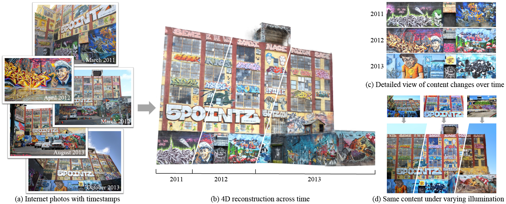

# Neural Scene Chronology

### [Project Page](https://zju3dv.github.io/neusc) | [Video](https://youtu.be/ak47wEZH1kY) | [Paper](https://arxiv.org/abs/2306.07970) | [Data](https://zjueducn-my.sharepoint.com/:f:/g/personal/haotongl_zju_edu_cn/EpL9XCKhfRNDmbrjeJC55T8B2XJiwlY_Ag9t9aBL2ULQ6g?e=HSUt9K)



> [Neural Scene Chronology](https://openaccess.thecvf.com/content/CVPR2023/html/Lin_Neural_Scene_Chronology_CVPR_2023_paper.html)  
> Haotong Lin, Qianqian Wang, Ruojin Cai, Sida Peng, Hadar Averbuch-Elor, Xiaowei Zhou, Noah Snavely \
> CVPR 2023

## Installation

### Set up the python environment

```
conda create -n nsc python=3.10
conda activate nsc
conda install conda install pytorch==1.12.1 torchvision==0.13.1 torchaudio==0.12.1 cudatoolkit=11.3 -c pytorch
pip install -r requirements.txt
pip install git+https://github.com/haotongl/kaolin.git@ht 
```

### Set up datasets

#### 0. Set up workspace
The workspace is the disk directory that stores datasets, training logs, checkpoints and results. Please ensure it has enough space. 
```
export workspace=$PATH_TO_YOUR_WORKSPACE
```
   
#### 1. Pre-trained model

Download the pretrained model from [this link](https://drive.google.com/drive/folders/1hRIHBBjj1JzyBc0WF6xuNwo-wTKuQ_3i?usp=sharing).

Or you can use the following command to download it.
```
cd $workspace
mkdir trained_model/nsc/5pointz/base
cd trained_model/nsc/5pointz/base
gdown 1edfa_pYk1m_wxC7dmiHcs40BA89z-kW6
```

#### 2. Chronology dataset (Optional; download it if you want do training)

Download the 5PointZ dataset from [this link](https://drive.google.com/drive/folders/1hRIHBBjj1JzyBc0WF6xuNwo-wTKuQ_3i?usp=sharing).

Or you can use the following command to download it.
```
cd $workspace
mkdir chronology
gdown 1ytPDh5s5bzVnPLU01jcQ4xOA9_DDgliD 
unzip 5pointz.zip -d chronology
rm 5pointz.zip
```

#### 3. Running neural scene chronology on your custom chronology dataset

Make sure you have prepared images with timestamps. The timestamp refers to the prefix of the image; please refer to the 5PointZ example dataset.

1. The first step is to run colmap SfM, and undistort the images, followed by dense reconstruction to obtain `meshed-poisson.ply`. Use Meshlab to select the region of interest from `meshed-poisson.ply`, and save it as `meshed-poisson-clean.ply`.

2. Generate semantic maps. The purpose of this step is to segment the sky for training the environment map, and to segment pedestrians and vehicles to avoid these pixels during training.
Please download the semantic model from [this link](https://github.com/open-mmlab/mmsegmentation/blob/c685fe6767c4cadf6b051983ca6208f1b9d1ccb8/configs/deeplabv3/README.md?plain=1#L59).
```
python scripts/semantic/prepare_data.py --root_dir ${CUSTOM_DATA_PATH} --gpu 0 
```

3. Generate annots. 

First, generate cam_dict.npy and train.txt, which store the camera pose and training list, respectively.
You can modify train.txt to select specific time periods, or keep some images for testing purposes.
```
python scripts/colmap/gen_annots.py --input ${CUSTOM_DATA_PATH}
```

Then, generate trash.txt to filter out some of the more noisy images. For example, images where more than two-thirds of the pixels are portraits, or images with very few points registered during the SfM process. These images usually provide little help to the model.
```
python scripts/colmap/gen_trash.py --data_root ${CUSTOM_DATA_PATH}
```


## Inference and Training

### Reproducing the demo video

The following command will render the demo video with the specified camera path and time.
```
python run.py --type evaluate --cfg_file configs/exps/nsc/5pointz_renderdemo.yaml test_dataset.input_ratio 1.
```

<!-- "configs/opts/5pointz.npy" is the camera path for the demo video. It is generated with Blender. -->

### Training a model

```
python train_net.py --cfg_file configs/exps/nsc/5pointz.yaml
```

Our code also supports multi-gpu training. The published pretrained model was trained for 400k iterations with 2 A6000 GPUs.
```
python -m torch.distributed.launch --nproc_per_node=2 train_net.py --cfg_file configs/exps/nsc/5pointz.yaml distributed True gpus 0,1
```


### Visualization

```
python run.py --type evaluate --cfg_file configs/exps/nsc/5pointz.yaml save_result True
```


## Citation

If you find this code useful for your research, please use the following BibTeX entry.

```
@inproceedings{lin2023neural,
  title={Neural Scene Chronology},
  author={Lin, Haotong and Wang, Qianqian and Cai, Ruojin and Peng, Sida and Averbuch-Elor, Hadar and Zhou, Xiaowei and Snavely, Noah},
  booktitle={CVPR},
  year={2023}
}
```

## Acknowledgement

We would like to thank [Shangzhan Zhang](https://zhanghe3z.github.io/) for the helpful disscussion. 
Some of the code releated to NGP in this repo is borrowed from [torch-ngp](https://github.com/ashawkey/torch-ngp), thanks Jiaxiang Tang!